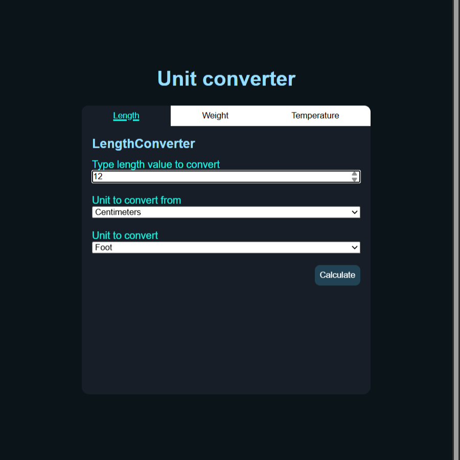
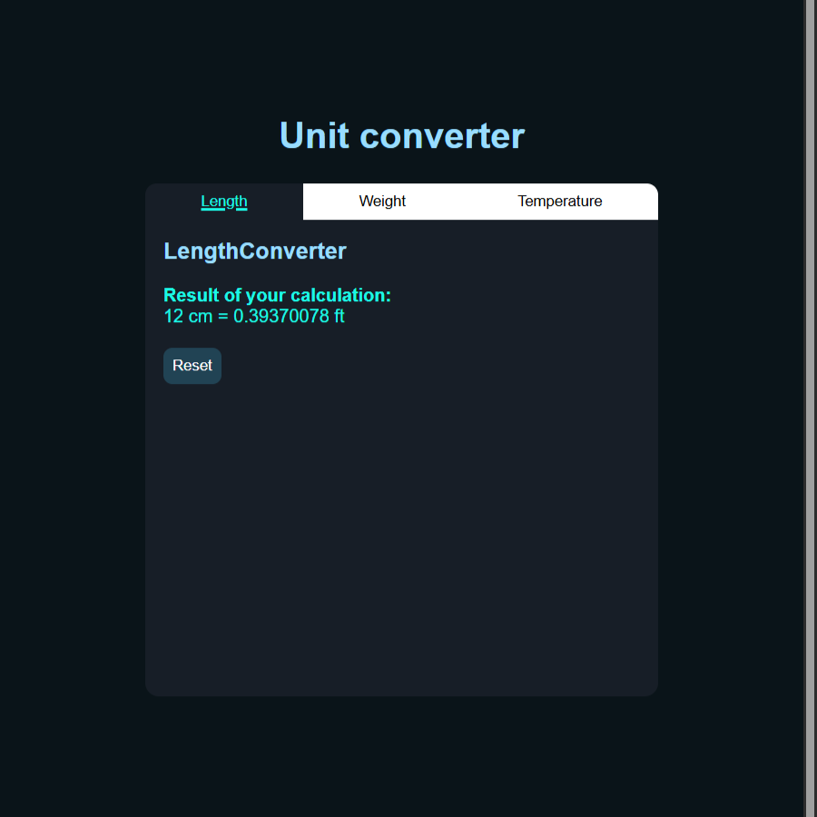

Convertidor de unidades
===

Proyecto creado como uno de los retos de Roadmap.sh

Aplicación de full stack diseñada con .NET 10, html, css y js para resolver el reto de roadmap.sh "[Convertidor de unidades](https://roadmap.sh/projects/unit-converter)".

Características
---

*   Api convertidora de unidades
*   Interfaz de usuario web para la conversion de unidades
*   Validación de datos
*   Conversion de longitud, peso y temperatura
*   Interfaz tipo pestaña para las distintas conversiones
*   Conexión fullstack de servicios
*   Manejo de errores

Instalación
--------

1.  Clona el repositorio
    
        git clone https://github.com/juanharodev/juanharodev.github.io.git
    

* * *

2.  Abre la una terminal y navega hasta la carpeta del proyecto
    
        cd /portfolio/roadmap-sh/backend/05-unit-converter
    

* * *

3.  Restaura las dependencias del proyecto
    
        dotnet restore
    

* * *

4.  Compila el proyecto
    
        dotnet build
    

* * *

5.  Abre "/portfolio/roadmap-sh/backend/05-unit-converter/program.cs" e indica el puerto que usaras como servidor web
    
        string localHostPort = "http://XXX.X.X.X:XXXX";
    

* * *

6.  Inicia el servicio de la API corriendo la aplicación
    
        dotnet run
    

* * *

7.  Inicia un servidor web local, como vscode live server (usada personalmente) y en el navegador abre "/portfolio/roadmap-sh/backend/05-unit-converter/pages/"
    

¿Cómo se usa?
---

Una vez iniciada la API y el servidor web, abre "/portfolio/roadmap-sh/backend/05-unit-converter/pages/" y usa la interfaz gráfica para realizar las distintas conversiones disponibles

También puedes ver el funcionamiento de la [interfaz de conversion](https://juanharodev.github.io/portfolio/roadmap-sh/backend/05-unit-converter/pages/) aunque no obtendrás resultados debido a la falta de la funcionalidad de la API

### Ejemplo de uso

 